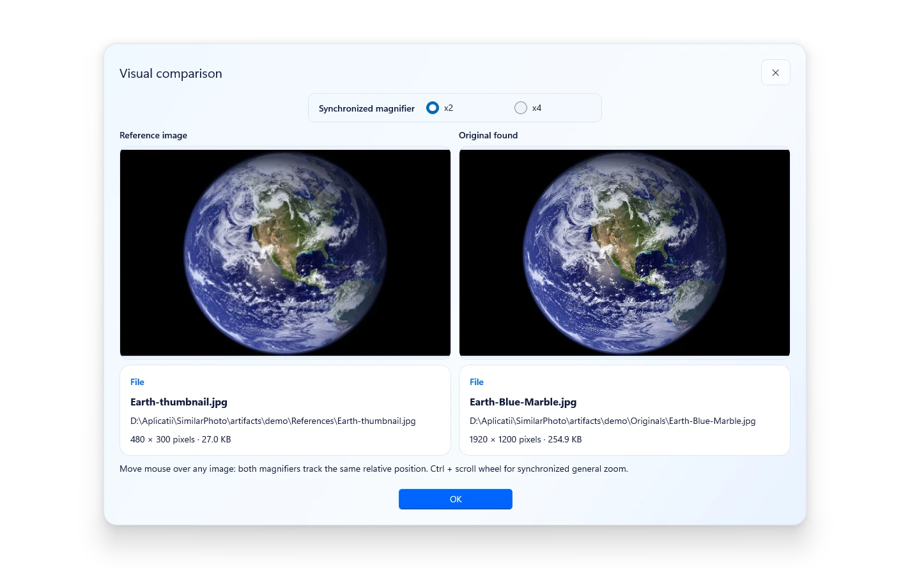
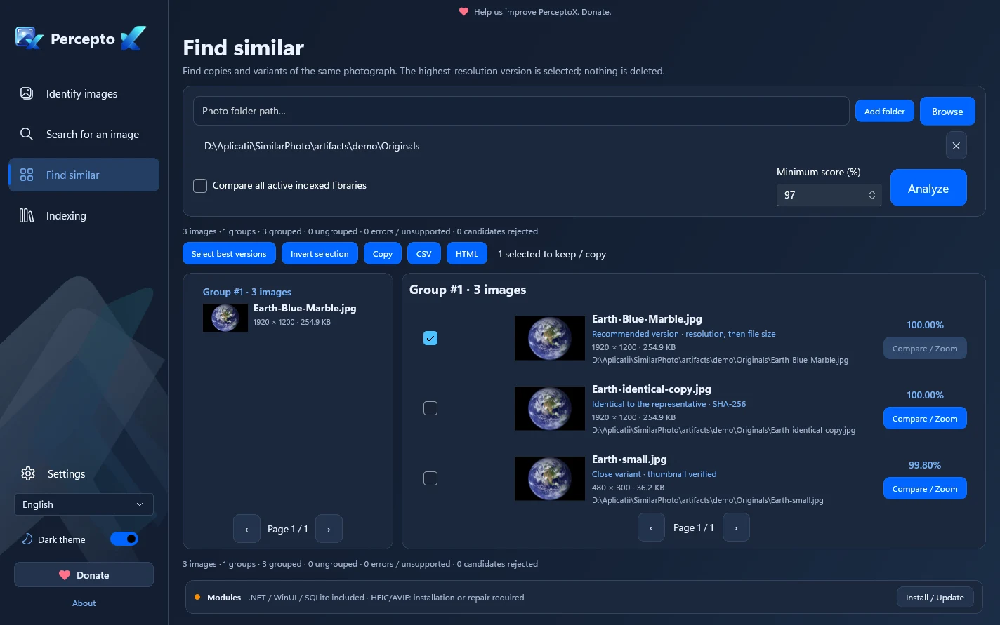

<p align="center"></p>
<h1 align="center">Find the original. Keep the best.</h1>
<p align="center">A Windows workspace for finding originals, inspecting matches and organizing near-identical photos.</p>
<p align="center"><a href="https://github.com/eduard-dev-coder/PerceptoX/releases">Downloads</a> · <a href="docs/USER_GUIDE.md">User guide</a> · <a href="docs/DEVELOPMENT.md">Build from source</a> · <a href="README.ro.md">Română</a></p>
<p align="center">  </p>


## Your photos, easier to recognize

Have a thumbnail, a resized copy or a screenshot, but need the original? Choose your reference folder and original-image library, then scan. Review the references alongside possible matches before copying anything.

- **Identify images:** match a reference folder against a local library and copy selected originals to a destination you choose.
- **Find an image:** search the index from a single image, including drag-and-drop from Windows.
- **Similar images:** group exact files and near-identical variants across one or several folders. Default minimum score: 97. The best-ranked exemplar is selected; you can invert the selection.
- **Compare visually:** side-by-side previews, metadata and a synchronized x2/x4 loupe.
- **Save your review:** CSV and thumbnail-based HTML reports for found, missing, ambiguous and near-identical matches.
- **Make it yours:** Light/Dark and English/Romanian switch immediately, without restarting. Additional translations are JSON catalogs.
- **Reuse your index:** incremental SQLite indexing, cached thumbnails, progress, cancellation and structured logs.

Image matching runs on your computer. You do not need an AI service, Ollama, Python or a development SDK to use a packaged build.

## Download and install

Get packages from **[GitHub Releases](https://github.com/eduard-dev-coder/PerceptoX/releases)**. If no assets are listed, the binary release has not been published; public source availability is not a download announcement.

| Package | Use |
| --- | --- |
| `PerceptoX-<version>-Setup-win-x64.exe` | Per-user installation, license review, offline codec activation and Desktop/Start shortcuts. |
| `PerceptoX-win-x64.zip` | Extract everything, then run **`PerceptoX.exe`**. Keep `app/` alongside the executable. |
| Sources and checksums | Rebuild and verify downloads. Native codec corresponding sources accompany binary releases separately. |

The x64 package includes .NET, WinUI/Windows App SDK, SQLite, graphics and the offline HEIC/HEIF/AVIF decoder payload. Codec activation/repair requires your consent. No silent download-on-start is assumed.

Target: Windows x64, Windows 10 build 19041 or newer / Windows 11. Clean-machine validation remains open; a development-PC smoke test does not certify every Windows edition or codec profile. See [Installation](docs/INSTALLATION.md) and [release readiness](docs/RELEASE_READINESS.md).

## See what you are keeping





These are unretouched renders of the running WinUI application using the real matching/grouping engine and an attributed NASA demonstration image with resized/recompressed variants. They are not AI mockups or accuracy benchmarks. [Screenshot provenance and credits](website/assets/SCREENSHOTS.md).

## A careful workflow

1. Choose **Reference images** and **Original images** in separate, non-nested folders.
2. Click **Scan**. Follow stages/counts in the dialog and cancel safely if needed.
3. Use **Compare / Zoom** to inspect candidates and their filenames.
4. Select the images to copy into a separate destination; export a report if useful.

In **Similar images**, selection means **the image to keep/copy**, not the image to delete. No preferred original folder is required. Copying does not delete source photos. Recoverable archival operations are separate and require review/confirmation. Keep backups.

Similarity is a heuristic score, not a probability. Crops, partial screenshots, overlays and watermarks are harder; multi-region matching and heatmaps/alignment are experimental. The comparison preview is bounded to 1024 pixels. No universal accuracy, million-image performance or zero-false-positive claim is made. [Known limitations](docs/KNOWN_LIMITATIONS.md).

## Build and contribute

C#/.NET 10, WinUI 3, CommunityToolkit.Mvvm, ImageSharp and SQLite. Layers separate Core, Application, Infrastructure, Presentation and WinUI; tests/benchmarks are independent projects.

```powershell
dotnet restore PerceptoX.sln --configfile NuGet.Config
dotnet build src/PerceptoX.WinUI/PerceptoX.WinUI.csproj -p:Platform=x64 --no-restore
dotnet test tests/PerceptoX.Core.Tests/PerceptoX.Core.Tests.csproj
```

SDK 10.0.301 is pinned. See [Development](docs/DEVELOPMENT.md), [Standalone packaging](docs/STANDALONE.md), [CONTRIBUTING](CONTRIBUTING.md), [localization](docs/LOCALIZATION.md) and [CHANGELOG](CHANGELOG.md). Report problems through [GitHub Issues](https://github.com/eduard-dev-coder/PerceptoX/issues), without private photos or unredacted logs.

## License and support

Created by **Prepelita Eduard**. Free of charge, with no donation-locked features. [Support development through PayPal](https://www.paypal.com/donate/?hosted_button_id=NFBKSEW3T4SFS).

PerceptoX-owned source is **[GPL-3.0-only](LICENSE)**, including commercial use under that license. Dependencies retain their own terms and are not relicensed as GPL. ImageSharp 3.1.12 is used under its Apache-2.0 grant for open-source use. See [NOTICE](NOTICE), [native corresponding sources](docs/THIRD_PARTY_SOURCES.md) and [release readiness](docs/RELEASE_READINESS.md).
