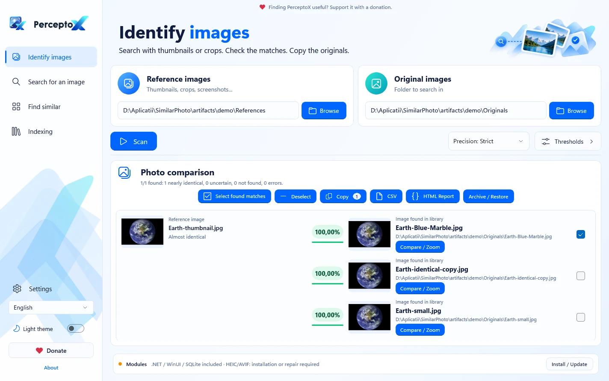

# PerceptoX — identifică imaginile, păstrează exemplarul potrivit

PerceptoX este o aplicație Windows care caută imaginile originale pornind de la miniaturi, copii redimensionate sau capturi de ecran. Alegi dosarul cu referințe și biblioteca de originale, scanezi, verifici imaginile alăturat și copiezi exemplarele selectate în alt dosar.

## Funcții

- Identificarea imaginilor prin compararea a două dosare.
- Căutare individuală, inclusiv drag-and-drop.
- Gruparea imaginilor identice/aproape identice din unul sau mai multe dosare; selecția implicită este exemplarul de păstrat/copiat. Selecția poate fi inversată.
- Comparație vizuală, metadate și lupă sincronizată x2/x4.
- Copierea selecției și export CSV/HTML.
- Light/Dark și română/engleză schimbate instantaneu; extensie prin cataloage JSON.
- Index SQLite incremental, cache de miniaturi și progres cu anulare sigură.

## Instalare

[Descărcările oficiale sunt în Releases](https://github.com/eduard-dev-coder/PerceptoX/releases). Dacă nu există fișiere publicate, distribuția binară nu este încă lansată. Setup-ul include dependențele și codecurile offline, cu acceptarea licențelor. Din ZIP extragi întregul dosar și pornești **PerceptoX.exe**; nu muți numai executabilul.

Nu ai nevoie de Ollama, Python, .NET instalat separat sau SDK-uri pentru folosirea pachetului standalone. Sunt necesare Windows x64 compatibil și suficient spațiu pentru index/miniaturi.

Scorul de similaritate este euristic, nu o probabilitate. Crop-urile, capturile parțiale și imaginile cu text sunt cazuri mai dificile. Copierea nu șterge originalele; arhivarea recuperabilă este separată și cere confirmare. Păstrează copii de siguranță.

Vezi [README în engleză](README.md), [ghidul de utilizare](docs/USER_GUIDE.md), [compilare](docs/DEVELOPMENT.md), [starea lansării](docs/RELEASE_READINESS.md) și [licența GPL-3.0-only](LICENSE). Dependențele păstrează propriile licențe; folosirea comercială a surselor este permisă în condițiile acestora.

Autor: **Prepelita Eduard**. Aplicația este gratuită, fără funcții condiționate de donații. [Susține dezvoltarea](https://www.paypal.com/donate/?hosted_button_id=NFBKSEW3T4SFS).
